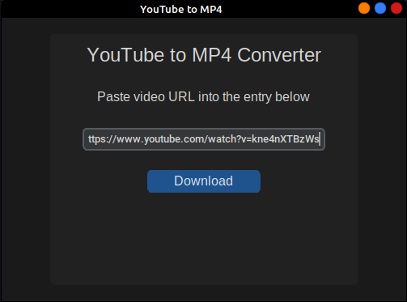
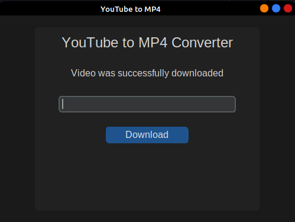

# YouTube_To_MP4
Meant for downloading YouTube videos locally. Made using pytube and [Custom Tkinker](https://github.com/TomSchimansky/CustomTkinter).
## Demo
Paste video URL and click download.

The video is saved in the current wokring directory.

